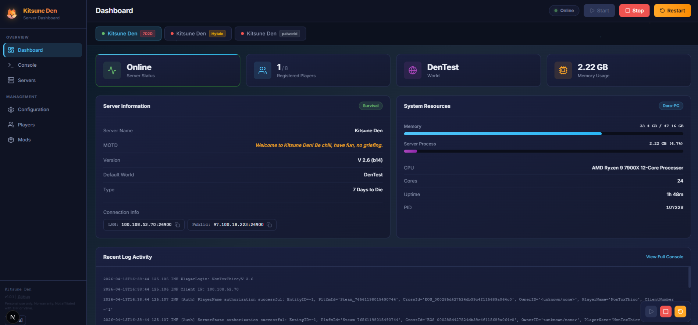
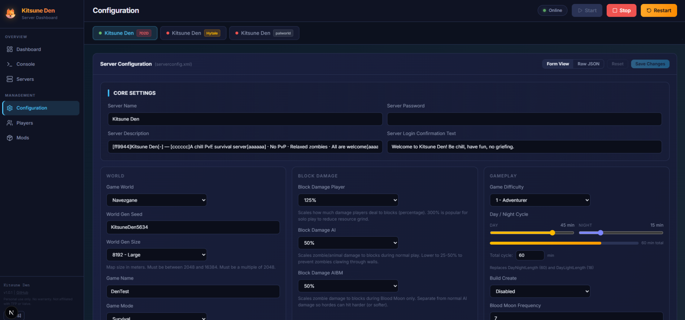
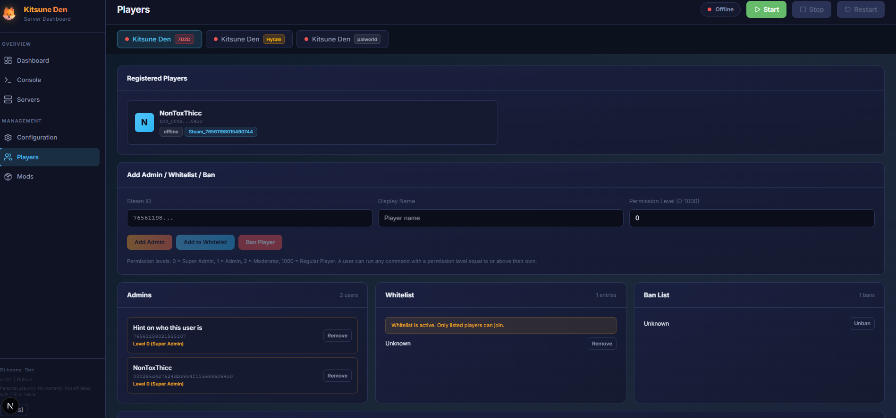

# 🦊 KitsuneDen

[](https://github.com/Kitsune-Den/KitsuneDen/actions/workflows/test.yml)
[](https://github.com/Kitsune-Den/KitsuneDen/actions/workflows/build.yml)
[](https://opensource.org/licenses/MIT)
[](https://nodejs.org)
[](https://github.com/Kitsune-Den/KitsuneDen)
[](src/den-operators-manual/00-preface.md)
[](https://en.wikipedia.org/wiki/Coffee)

A warm, unified dashboard for managing your home game servers.

KitsuneDen treats your servers like living things — each one with its own personality, its own logs, its own place in the Den. It's built for the kind of person who runs a Minecraft server for their friends, a 7 Days to Die world for the weekend, and wants one clean interface to watch over all of it.

---



---

## What it does

- **Multi-server switcher** — manage multiple game servers from one dashboard, with live status indicators
- **Add servers from the UI** — no more editing config files by hand; add, edit, and remove servers with a native folder picker
- **Live console** — real-time log streaming with command input and history
- **Server controls** — start, stop, restart from the top bar with one click
- **Player management** — whitelist, op, ban, and kick controls
- **Mod & modpack management** — upload, organize, and activate mod sets
- **Config editor** — structured editing with friendly widgets (like the day/night cycle slider for 7D2D)
- **World & backup views** — browse worlds, trigger and manage backups
- **Connection info** — LAN and public IP display with click-to-copy




---

## Supported games

| Game | Type | Status |
|------|------|--------|
| Minecraft (Fabric) | `minecraft` | ✅ Full support |
| Minecraft (NeoForge) | `minecraft` | ✅ Full support |
| Minecraft (Vanilla/other) | `minecraft` | ✅ Full support |
| 7 Days to Die | `7d2d` | ✅ Full support |
| Hytale | `hytale` | ✅ Full support |
| Palworld | `palworld` | ✅ Full support |
| Enshrouded | `enshrouded` | ✅ Full support |
| Others | — | 🔧 Add your own adapter |

Adding a new game type means writing one adapter class. See [Adding a new game](#adding-a-new-game).

---

## Getting started

### Prerequisites

- [Node.js](https://nodejs.org/) 18+
- Your game server(s) installed and runnable

### Install

```bash
git clone https://github.com/Kitsune-Den/KitsuneDen.git
cd KitsuneDen
npm install
```

### Configure

You can add servers directly from the dashboard UI — click **Add Server** on the Servers page, pick your game type, browse to the install directory, and fill in the connection details.

Or if you prefer, copy the example config and edit it manually:

```bash
cp servers.example.json servers.json
```

See [Configuration](#configuration) for field details.

### Run

```bash
npm run dev       # development
npm run build     # production build
npm run start     # production start
```

Open `http://localhost:3000` (or whatever port you set in `servers.json`).

---

## Configuration

`servers.json` is your Den's map. It tells KitsuneDen where your servers live and how to talk to them. You can edit it through the dashboard UI or by hand.

```json
{
  "servers": [
    {
      "id": "fabric",
      "name": "Fabric",
      "type": "minecraft",
      "dir": "C:\\GameServers\\fabric-server",
      "loader": "Fabric",
      "version": "1.21.4",
      "jar": "fabric-server-launch.jar",
      "launchMode": "jar",
      "gamePort": 25565,
      "rconPort": 25575,
      "rconPassword": "your-rcon-password"
    }
  ],
  "dashboard": {
    "port": 3000
  }
}
```

See `servers.example.json` for full examples including NeoForge (argfile launch), Hytale, 7 Days to Die, and Palworld.

### Server types

**`minecraft`** — Fabric, NeoForge, Vanilla, and most other loaders

| Field | Required | Description |
|-------|----------|-------------|
| `dir` | ✅ | Path to server directory |
| `jar` | For jar mode | Server jar filename |
| `launchMode` | ✅ | `"jar"` or `"argfile"` |
| `argFiles` | For argfile mode | JVM arg files (NeoForge) |
| `javaPath` | Optional | Full path to java executable |
| `gamePort` | ✅ | Port players connect to |
| `rconPort` | Optional | RCON port for commands |
| `rconPassword` | Optional | RCON password |

**`7d2d`** — 7 Days to Die

| Field | Required | Description |
|-------|----------|-------------|
| `dir` | ✅ | Path to server directory |
| `configFile` | Optional | Config XML filename |
| `telnetPort` | Optional | Telnet port |
| `telnetPassword` | Optional | Telnet password |
| `modsDir` | Optional | Mods directory name |

**`hytale`** — Hytale

| Field | Required | Description |
|-------|----------|-------------|
| `dir` | ✅ | Path to server directory |
| `startScript` | Optional | Startup bat/script |
| `backupScript` | Optional | Backup script path |
| `processFilter` | Optional | Process name filter |
| `gamePort` | ✅ | Port players connect to |

**`palworld`** — Palworld

| Field | Required | Description |
|-------|----------|-------------|
| `dir` | ✅ | Path to server directory |
| `steamCmdPath` | Optional | Path to steamcmd.exe for updates |
| `gamePort` | Optional | Game port (default 8211) |
| `rconPort` | Optional | RCON port |
| `rconPassword` | Optional | RCON password |
| `restApiPort` | Optional | REST API port (default 8212) |
| `restApiPassword` | Optional | REST API password |

**`enshrouded`** — Enshrouded

| Field | Required | Description |
|-------|----------|-------------|
| `dir` | ✅ | Path to server directory |
| `startScript` | Optional | Startup bat (falls back to `enshrouded_server.exe`) |
| `configFile` | Optional | Config filename (default `enshrouded_server.json`) |
| `steamCmdPath` | Optional | Path to steamcmd.exe for updates (Steam app id 2278520) |
| `gamePort` | Optional | UDP game port (default 15637) |
| `queryPort` | Optional | UDP Steam query port (default 15638) |

> Enshrouded ships no RCON or REST API, so live commands are unavailable;
> player presence is best-effort scraped from connect/disconnect log lines.

---

## Adding a new game

KitsuneDen uses an adapter pattern. Every game type is an adapter class that implements the `ServerAdapter` interface.

1. Create `src/lib/adapters/your-game-adapter.ts`
2. Implement the `ServerAdapter` interface from `types.ts`
3. Register it in `adapter-registry.ts`
4. Add the type to `ServerDefinition` in `types.ts`

The interface covers lifecycle (start/stop/restart), logs, stats, config, and players. Implement what your game supports — capabilities flags tell the UI what to show.

```ts
export const capabilities: ServerCapabilities = {
  hasRcon: false,
  hasMods: true,
  hasModPacks: false,
  hasBackups: true,
  hasWorlds: true,
  hasWarps: false,
  hasServerProperties: false,
  hasJsonConfig: true,
};
```

---

## Auto-start on Windows

KitsuneDen runs best as a scheduled task rather than a startup script (antivirus software tends to block `.bat` files in shell startup).

1. Open **Task Scheduler**
2. Create a new task:
   - **Trigger:** At startup (with 30s delay)
   - **Action:** `node` with arguments `server.js`, start in your KitsuneDen directory
   - **Run with highest privileges**
   - **Restart on failure**
3. Test it manually before trusting it to run unattended

---

## The Den

KitsuneDen is built with a philosophy: your servers aren't cold infrastructure, they're creatures worth tending. Dashboards are companions. Logs are journals. Ports are doorways.

The [Operator's Manual](src/den-operators-manual/00-preface.md) covers everything about the Den's architecture, spirits, and care — written to be understood, maintained, and enjoyed.

---

## Stack

- [Next.js](https://nextjs.org/) — App Router, TypeScript
- [Tailwind CSS](https://tailwindcss.com/) — utility-first styling
- [Lucide](https://lucide.dev/) — icons

---

## Contributing

Pull requests welcome. If you've written an adapter for a new game, please share it — the Den grows when more spirits join.

---

## License

MIT
